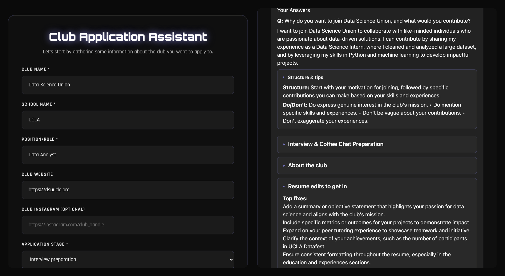
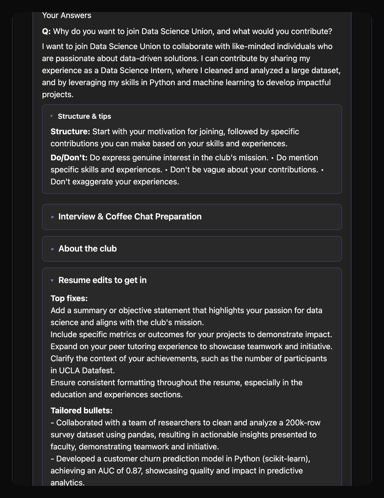
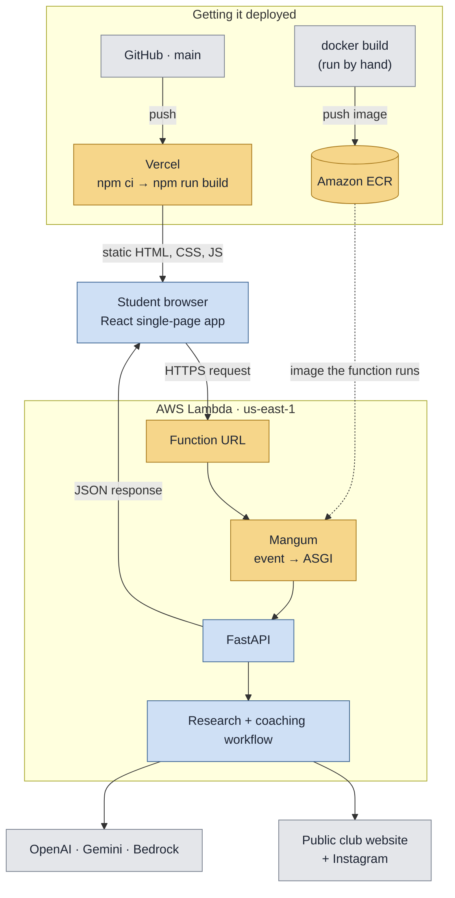
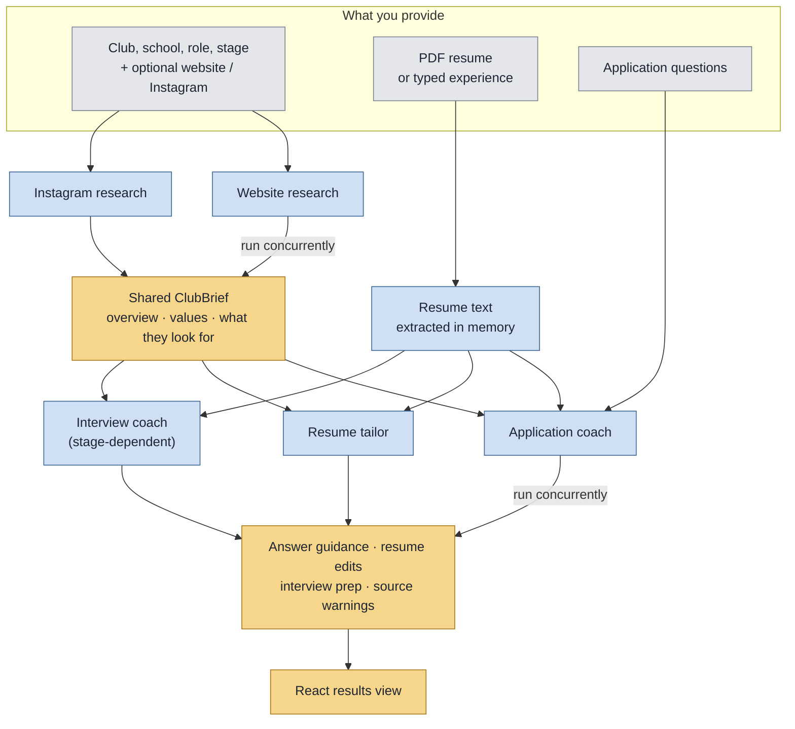

<p align="center">
  
</p>

<h1 align="center">ClubApply</h1>
<p align="center"><strong>Know the club. Connect your experience. Show up prepared.</strong></p>
<p align="center">An AI-assisted workspace for university club applications, resume preparation, and interviews.</p>

<p align="center">
  <a href="https://clubapply.vercel.app">Open the live app</a> ·
  <a href="#architecture">Architecture</a> ·
  <a href="#run-locally">Run locally</a> ·
  <a href="#deployment">Deployment</a>
</p>

<p align="center">
  
  
  
</p>

---

## Why ClubApply exists

Applying to a university club can mean piecing together a website, an Instagram profile, a resume, and a list of questions—then figuring out how they relate to each other.

**ClubApply brings that preparation into one workflow.** Students provide the club they are interested in, their experience, and the questions they need to answer. The application researches available club sources and produces a club overview, application guidance, resume suggestions, and optional interview preparation.

Originally built for the **AWS × Bruin AI Hackathon at UCLA in October 2025**, the project now runs a React frontend on Vercel and a container-based FastAPI backend on AWS Lambda.

## From interest to application

| Step | What you provide | What happens |
| --- | --- | --- |
| **1. Choose your club** | Club, school, role, application stage, and optional website/Instagram URLs | Establish the context for your application |
| **2. Add your experience** | A text-based PDF resume or manually entered education, projects, experience, and skills | Give the coaching stages material to work with |
| **3. Prepare your answers** | Questions entered directly or imported from a `.txt` file | Generate answer guidance, resume edits, and preparation matched to your selected stage |

The interface supports **online applications**, **coffee chats/networking**, and **interview preparation**. Results include expandable sections for the club brief, answer structure, and resume suggestions.

**Try it:** [Open ClubApply](https://clubapply.vercel.app), enter a club and your experience, then add a question such as “Why do you want to join this club?” You can try the workflow without a resume by entering experience manually. Supplied source URLs enrich the research; missing or inaccessible sources limit what the app can learn.

### What comes back

<p align="center">
  
</p>

Every section is generated against the club brief **and** your own experience — the tailored bullets above quote the applicant's actual dataset size and model score rather than generic filler. The `About these results` panel states what the run could not reach, so weak sources are visible instead of silently degrading the output.

## Architecture

Vercel serves the React build to the browser. The browser sends HTTPS requests to a Lambda Function URL, where Mangum adapts the incoming event for FastAPI. Python coordinates research and coaching, then returns JSON for React to display.



**Two independent deployment paths.** A push to `main` rebuilds the frontend on Vercel automatically. The backend does not: changing Python means rebuilding the Docker image, pushing it to ECR, and updating the Lambda function. A Git push alone never redeploys the API.

### Inside a guidance request

The active web interface calls `/agents/application-coach`. Research sources run concurrently. Once a club brief is available, application and resume coaching run concurrently, with interview preparation added for the relevant application stages.



Every model call goes through one shared adapter that tries providers in order — **Gemini → OpenAI → Bedrock** — each capped at `LLM_TIMEOUT_SECONDS`. A provider that is unconfigured, errors, or hangs hands off to the next; if all of them fail, the stage falls back to keyword heuristics and the response says so in `warnings` rather than failing the request.

PDF uploads return extracted text to the frontend, which includes it in the guidance request. This avoids relying on a file persisting across separate Lambda invocations.

### Six specialized stages

| Stage | Responsibility |
| --- | --- |
| **Website researcher** | Fetch and analyze available public club website content |
| **Instagram researcher** | Extract useful signals from accessible public profile content |
| **Summarizer** | Combine findings into a shared `ClubBrief` |
| **Resume tailor** | Suggest ways to connect applicant experience to the club |
| **Application coach** | Develop responses and answer strategies for application questions |
| **Interview coach** | Generate preparation topics and practice guidance |

The CLI and `/clubapply/run` expose a separate six-stage orchestrator that assembles a Pydantic `FinalReport`. The web endpoint composes its own workflow from the same stage modules; it does not call that orchestrator directly.

These stages use **Python `asyncio`, specialized prompts, Pydantic models, and direct model SDKs**. The historical `clubapply_strands` package name remains, but the current implementation does not instantiate Strands Agents or a Strands Swarm.

## Engineering decisions

- **A shared brief:** Research is distilled into one structured representation used by the coaching stages.
- **Concurrent work:** Independent research and coaching tasks overlap; blocking model, HTTP, and PDF work is offloaded to worker threads.
- **Multiple model providers:** Adapters support AWS Bedrock, OpenAI, and Gemini. The preferred provider is tried first, followed by other configured providers. If all attempts fail, stages can use heuristic fallbacks.
- **Explicit demo mode:** `LLM_PROVIDER=offline` disables model calls for a credential-free local demonstration. Generic fallback output is not evidence of a successful model call.
- **Separate hosting responsibilities:** Vercel publishes the React build; Lambda executes Python on demand; ECR stores the backend image. The two deploy on independent triggers.
- **Browser integration:** `REACT_APP_API_URL` supplies the backend address at build time, and backend CORS settings allow the deployed frontend origin.

## Built with

| Layer | Technologies |
| --- | --- |
| Interface | React 19, JavaScript, CSS, Tailwind styling |
| API | Python 3.11+, FastAPI, Pydantic, Mangum |
| Workflow | `asyncio`, specialized research and coaching modules |
| Model integrations | AWS Bedrock, OpenAI, Google Gemini |
| Hosting | Vercel (frontend), AWS Lambda, Amazon ECR, Docker |
| Frontend delivery | GitHub integration, `vercel.json`, npm |
| Verification | Jest and React Testing Library; manual deployment smoke checks |

## Run locally

Prerequisites: **Python 3.11+**, **Node.js/npm**, and Git.

```sh
git clone https://github.com/yechanlin/AWS-x-Bruin-AI.git
cd AWS-x-Bruin-AI
python3 -m venv .venv
source .venv/bin/activate
python -m pip install -e .
```

Start the API in one terminal. This example disables model calls so you can explore without API credentials:

```sh
LLM_PROVIDER=offline uvicorn clubapply_strands.server.app:app --reload --port 8000
```

Start React in a second terminal:

```sh
cd client
npm ci
npm start
```

Open **http://localhost:3000**. The API exposes a health check at **http://localhost:8000/health** and interactive endpoint documentation at **http://localhost:8000/docs**.

### Enable model-backed guidance

Copy `.env.example` to `.env` and configure a supported provider. Keep credentials in the backend environment; the frontend only needs the public API URL.

```sh
cp .env.example .env
```

| Setting | Purpose |
| --- | --- |
| `LLM_PROVIDER` | Preferred provider: `bedrock`, `openai`, `gemini`, or `offline` |
| `OPENAI_API_KEY` / `OPENAI_MODEL` | OpenAI credentials and model selection |
| `GEMINI_API_KEY` / `GEMINI_MODEL` | Gemini credentials and model selection |
| `AWS_PROFILE` / `AWS_DEFAULT_REGION` / `BEDROCK_MODEL_ID` | Local AWS identity, region, and Bedrock model selection |
| `LLM_TIMEOUT_SECONDS` | Model attempt timeout; defaults to 20 seconds |
| `ALLOWED_ORIGINS` | Comma-separated frontend origins accepted by backend CORS |
| `REACT_APP_API_URL` | Frontend build/start variable; defaults to `http://localhost:8000` |

Use model IDs available to your account and supported by the adapters. On Lambda, Bedrock can use the function's execution role. Restart the API without the `LLM_PROVIDER=offline` command override to enable configured model calls. Offline model mode does not disable source fetching in the web API.

### CLI workflow

```sh
LLM_PROVIDER=offline clubapply-strands \
  --club "Example Club" \
  --school "UCLA" \
  --resume ./resume.pdf \
  --questions '["Why this club?", "Describe a relevant project."]'
```

The CLI writes a structured report under `out/`. Supply your own PDF. Add `--online` to enable source fetching; omitting it does not itself disable model calls.

## Deployment

**Live app:** [clubapply.vercel.app](https://clubapply.vercel.app)

| Component | Deployment behavior |
| --- | --- |
| Frontend | GitHub `main` → Vercel → `npm ci` → `npm run build` → publish `client/build` |
| Backend | Docker build → ECR push → Lambda image update |
| API access | Public Function URL, with both URL-invocation permissions and application CORS |

See the [backend deployment guide](docs/DEPLOYMENT.md) and [Amplify notes](docs/AMPLIFY.md). Vercel is the active frontend host; an AWS Amplify app remains connected to the same repository as a working fallback, and the docs retain an earlier S3 alternative.

Hosting and model use are subject to provider pricing and account allowances; this project does not promise a zero-cost deployment.

## Repository map

```text
AWS-x-Bruin-AI/
├── client/                 React application and UI tests
│   └── src/services/       Frontend API client
├── server/
│   ├── app.py              FastAPI routes and web guidance workflow
│   └── lambda_handler.py   Mangum entry point for Lambda
├── agents/                 Six research/coaching stages and model adapters
├── tools/                  URL fetching and PDF text extraction
├── schemas.py              Shared Pydantic data models
├── orchestrator.py         Full six-stage pipeline for CLI and API
├── main.py                 CLI entry point
├── Dockerfile              Lambda backend image
├── vercel.json             Frontend build configuration (Vercel)
├── amplify.yml             Frontend build configuration (Amplify fallback)
├── scripts/                Deployment helpers
└── docs/                   Architecture walkthroughs and deployment notes
```

## Verification and current scope

Run the frontend tests and production build:

```sh
CI=true npm --prefix client test -- --watchAll=false --runInBand
npm --prefix client run build
```

The UI tests cover manual experience submission, PDF upload handling, and the interview/question-import path with mocked API calls. Live smoke checks have verified frontend delivery, Lambda health, CORS from the deployed origin, and a full manual-input guidance request against production; these are not a comprehensive backend integration suite.

ClubApply is a **hackathon prototype**. Public-source access can fail, Instagram coverage is limited by what is publicly accessible, and model failures may produce generic templates. Authentication, rate limiting, stronger URL-fetch protections, and production data-handling controls remain future work. CORS is a browser policy, not authentication. Use demo information when exploring the public app.

There is no persistent application database or vector-retrieval system in the current architecture.

## Explore further

- [Project walkthrough](docs/PROJECT_GUIDE.md)
- [AWS Amplify deployment](docs/AMPLIFY.md)
- [Backend deployment](docs/DEPLOYMENT.md)
- [Local testing notes](docs/LOCAL_TESTING.md)

For contributions, open an issue or pull request with the problem, the proposed behavior, and how you verified it. Keep frontend and backend deployment requirements clear, and never commit credentials.

---

<p align="center"><em>Your experience is the starting point. ClubApply helps you connect it to the opportunity.</em></p>
